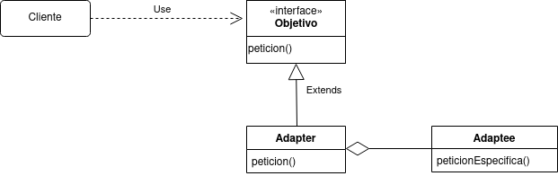

# Adapter
El patrón adapter convierte la interfaz de una clase en otra interfaz que los clientes esperan. Este patrón permite a las clases trabajar juntas, ya que no tienen otra forma de hacerlo, debido a que las interfaces de estas son incompatibles.



- Client: Actor que interactúa con el Adapter.
- Target: Interface que nos permitirá homogeneizar la forma de trabajar con las interfaces incompatibles, esta interfaz es utilizada para crear los Adapter.
- Adapter: Representa la implementación del Target, el cual tiene la responsabilidad de mediar entre el Client y el Adaptee. Oculta la forma de comunicarse con el Adaptee.
- Adaptee: Representa la clase con interface incompatible.

## Ejemplo
Supongamos que tenemos un programa que permite que distintos tipos de autos a combustión se manejen solos. Entre otras cosas, el programa permite encender dichos autos. El programa implementa una interfaz (__Target__) que permite utilizar varios tipos de autos a combustión de la misma manera. La interfaz Auto, es la siguiente:
```java
    public interface Auto{
        public void encender(); //peticion, gira la llave
    }
```
y uno de los tipos de autos es:
```java
    public class AutoComun implements Auto{
        public AutoComun(){...} //constructor
        public void encender(){...} //peticion, gira la llave
    }
```

Debido a la evolución de la industria automovilística, empiezan a aparecer los autos eléctricos, por lo que queremos utilizar nuestro programa para que los autos eléctricos también puedan ser manejados. Cuando conseguimos uno de estos autos, nos damos cuenta de que ya tiene una interfaz que permite interactuar con el auto desde una computadora, por lo que si utilizamos dicha interfaz, no tendremos que programarla desde cero como hicimos con los autos a combustión. La interfaz (no es una interfaz como tal, sino una clase que permite la interaccion) en cuestión es:
```java
    public class AutoElectrico{
        public void encendidoElectrico(){...} //peticion especifica
    }
```
Como podemos ver, no podemos encender el auto eléctrico de la misma manera que los autos a combustión, por lo tanto tenemos que crear algo (__Adapter__) que permita al programa de automanejo interactuar con el auto eléctrico. Este es el adapter:


La implementación en java para el adapter quedaria asi:

##### Clase Adapter:
```java
    public class AutoAdapter implements Auto{
        private AutoElectrico auto;
        public AutoAdapter(){
            this.auto = new AutoElectrico();
        }
        public void encender(){ //peticion
            auto.encendidoElectrico(); //peticion especifica
        }
    }
```
De esta manera, nuestro programa queda adaptado para usar autos eléctricos.

