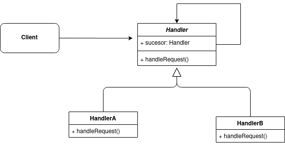
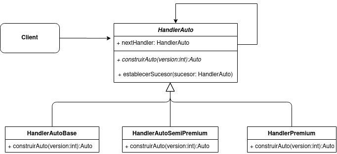

# Chain of Responsibility
El patrón Chain of Responsibility (Cadena de Responsabilidad), te permite crear una cadena de objetos que examinan una peticio. Cada objeto de la cadena examina la solicitud y decide si la maneja o la pasa al siguiente objeto en la cadena.
El patrón se usa cuando varios objetos pueden manejar cierta petición, y el manejador no se conoce a priori, sino que debería determinarse automáticamente.



## Ejemplo

Supongamos que tenemos una linea de produccion de autos donde si bien se fabrica el mismo modelo de auto, se ofrecen tres versiones:
 - 1 - Base: Tiene todas las partes esenciales pero ningún agregado premium
 - 2 - Semi-premium: Tiene GPS y un motor más potente
 - 3 - Premium: Tiene GPS, motor más potente e interior de cuero


La clase Auto y sus hijos se definen de la siguiente manera:

```java
public abstract class Auto{
    private String version;
    public Auto(String version){
        this.version = version;
    }
}
```
```java
public class Base extends Auto{
    public Base(){
        super("Base");
    }
}
```
```java
public class SemiPremium extends Auto{
    public SemiPremium(){
        super("Semi-Premium");
    }
}
```
```java
public class Premium extends Auto{
    public Premium(){
        super("Premium");
    }
}
```
Para diseñar el sistema con el patrón de diseño Chain of Responsability, deberemos implementar los manejadores (Handlers) de la futura cadena:



```java
public abstract class HandlerAuto{
    private HandlerAuto nextHandler;
    public HandlerAuto(){
        this.nextHandler = null;
    }
    public abstract Auto construirAuto(int version);
    public void establecerSucesor(HandlerAuto sucesor){
        this.nextHandler = sucesor;
    }
    
}
```
```java
public class HandlerAutoBase extends HandlerAuto{
    public HandlerAutoBase(){...}
    
    public Auto construirAuto(int version){
        if(version == 1){
            return new Base();
        } else{
            nextHandler.construitAuto(version);
        }
    }
}
```
```java
public class HandlerAutoSemiPremium extends HandlerAuto{
    public HandlerAutoSemiPremium(){...}
    
    public Auto construirAuto(int version){
        if(version == 2){
            return new SemiPremium();
        } else{
            nextHandler.construitAuto(version);
        }
    }
    
}
```
```java
public class HandlerAutoPremium extends HandlerAuto{
    public HandlerAutoPremium(){...}
    
    public Auto construirAuto(int version){
        if(version == 3){
            return new Premium();
        } else{
            nextHandler.construitAuto(version);
        }
    }
    
}
```
Ahora lo único que queda es ensamblar la cadena:
```java
public class Main{
    public static void main(String[] args){
        //declaramos los objetos de la cadena
        HandlerAutoBase hb = new HandlerAutoBase();
        HandlerAutoSemiPremium hsp = new HandlerAutoSemiPremium();
        HandlerAutoPremium hp = new HandlerAutoPremium();
        
        //asignamos el orden de la sucesion
        hb.establecerSucesor(hsp);
        hsp.establecerSucesor(hp);
        //segun el problema, el orden de la sucesion puede afectar el resultado
        
        //ahora solo queda realizar una peticion al primer objeto de la cadena
        Auto miAuto = hp.construirAuto(2); //obtendremos un auto semi-premium
        
    }
}
```
