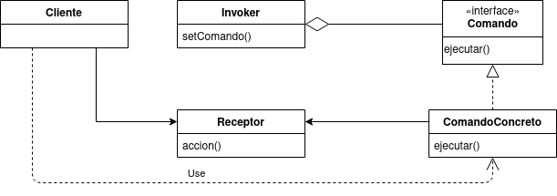
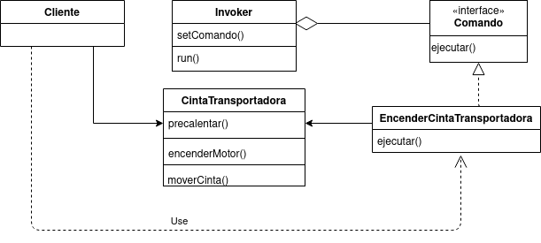

# Command
El patron Command encapsula una peticion como un objeto, lo que permite parametrizar  objetos con diferentes solicitudes, colas de solicitudes o de registro, y admitir operaciones que no se pueden deshacer. Es muy utilizado en situaciones que requieren hacer ejecuciones sin conocer realmente lo que hacen.



- Comando: interfaz que representa la orden que se pretende ejecutar de manera desacoplada, permitiendo su ejecución mediante el método ejecutar.
- Comando Concreto: implementa Comando y contiene una referencia al objeto Receptor, el cual contiene la auténtica funcionalidad. La implementación de ejecutar se compondrá de una serie de acciones realizadas por Receptor.
- Receptor: Objeto que implementa la funcionalidad que deseamos implementar en el Comando. Uno o varios de sus métodos serán llamados a la hora de invocar a la función execute del Command.
- Invoker: clase encargada de invocar el método Comando.ejecutar().
- Cliente: Establece la configuración del Comando Concreto y el Receptorr.

## Ejemplo
Supongamos que nos encargaron la automatizacion de ciertas en una fabrica que son realizadas por los operarios todos los dias. Si bien estas tareas deben ser realizadas automaticamente, un operario tiene que activarla debido a que el operario primero necesita comprobar el estado de la planta, si el operario da el ok, las tareas pueden ser llevadas a cabo tan solo presionando un boton en el tablero de control. Una de las tareas que se realizan en la fabrica es la de encender encender cintas transportadoras las cuales, para encenderse, necesitan seguir una serie de pasos: 1) Precalentar el motor de la cinta, 2) Encender el motor y 3) Iniciar el movimiento de la cinta. Para solucionar este problema utilizando el patron de diseño Command, deberemos implementar lo siguiente:



##### Comando
```java
   public interface Comando{
       public void ejecutar();
   }
```
##### Receptor
Implementara las funcionalidades especificas para mover una cinta transportadora
```java
    public class CintaTransportadora{
        //Acciones
        public void precalentar(){...}
        public void encenderMotor(){...}
        public void moverCinta(){...}
    }
```
##### ComandoConcreto
Aqui definiremos que hacer para encender la cinta transportadora

```java
    public class EncenderCintaTransportadora implements command{
        private CintaTransportadora cinta;
        public EncenderCintaTransportadora(CintaTransportadora cinta){
            this.cinta = cinta //se le pasa una cinta especifica
        }
        public void ejecutar(){
            cinta.precalentar();
            cinta.encenderMotor();
            cinta.moverCinta();
        }
    }
```
##### Invoker
```java
    public class TableroControl{
        private Comando c;
        
        public TableroControl(){}
        
        public void setComando(Comando c){
            this.c = c;
        }
        public void run(){
            c.ejecutar();
        }
    }
```

#### Client
De esta manera, el operario solo debera el operario solo debera acceder al tablero de control y presionar el boton para encender la cinta transportadora:

```java
    public static void main(String[]args){
        TableroControl tablero = new TableroControl(); //invoker
        CintaTransportadora cinta = new CintaTransportadora(); //creo un objeto de una de las cintas transportadoras
        EncenderCintaTransportadora encender = new EncenderCintaTransportadora(cinta);
        tablero.setComando(encender);
        tablero.ejecutar(); //enciendo la cinta transportadora;
        
    }
```

