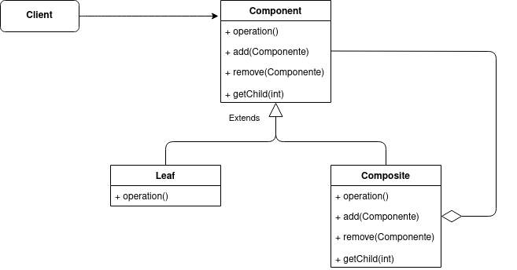
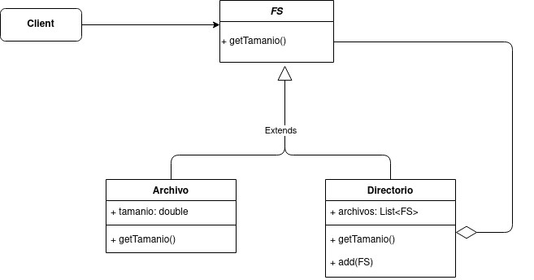

# Composite
El patrón Composite (Compuesto) te permite componer objetos en estructuras tipo árbol para representar jerarquías de parte completa. Composite le permite a los clientes tratar objetos y composiciones de objetos de una manera uniforme.



- Component: Declara la interfaz común. También declara operaciones para acceder a los hijos (no es obligatorio). Implementa el comportamiento predeterminado que es común a todas las clases.
- Leaf: representa el componente mínimo del arbol, implementa la operación a realizar.
- Composite: Almacena sus componentes hijos e implementa las operaciones relacionadas con los hijos.
- Client: Manipula los objetos de la composición a través de la interfaz de Component.


## Ejemplo

Supongamos que tenemos un sistema de archivos (FS), en el cual tenemos archivos simples (txt,exe,etc) y carpetas. El FS (File System) puede tener archivos y directorios, y a su vez, este último puede tener otros archivos y directorios. Utilizando el patrón Composite, el problema nos quedaría planteado de la siguiente manera:



#### Component
```java
public abstract class FS{
    public abstract double getTamanio();
}
```

#### Leaf
```java
public class Archivo extends FS{
    private double tamanio;
    
    public Archivo(double tamanio){
        this.tamanio = tamanio;
    }
    public double getTamanio(){
        return this.tamanio;
    }
}
```
#### Composite
```java
public class Directorio extends FS{
    private List<FS> archivos;
    
    public Directorio(){
        this.archivos = new ArrayList<FS>();
    }
    public void add(FS nuevo){
        if(!archivos.contains(nuevo){
            archivos.add(contains);
        }
    }
    public double getTamanio(){
        double tamanio = 0;
        for(FS i : archivos){
            tamanio + = i.getTamanio();
        }
    }
}
```
#### Client
```java
public class Client{
    public static void main(String[] args){
        Archivo a = new Archivo(22.6);
        archivo b = new Archivo(15.0);
        Archivo c = new Archivo(51.4);
        Archivo d = new Archivo(18.9);
        Directorio e = new Directorio();
        Directorio f = new Directorio();
        
        e.add(a);
        e.add(b);
        f.add(e);
        f.add(c);
        f.add(d);
        
        e.getTamanio(); // 22.6 + 15.0 = 37.6
        f.getTamanio() // 37.6 + 51.4 + 18.9 = 107.9
    }
}
```
De esta manera podemos tener la cantidad de archivos y subcarpetas que queramos y obtener el tamaño de un archivo en particular o de todos los archivos contenidos en un directorio y subdirectorios.
