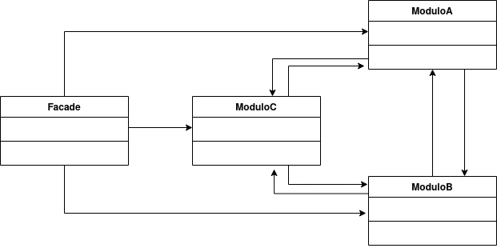

# Facade
El patron Facade provee una interfaz unificada a un conjunto de interfaces en un sibsistema. Facade define una interfaz de alto nivel para hacer que el subsistema sea mas facil de usar.



## Ejemplo
Supongamos que nos piden desarrollar una red social en la cual, entre otras actividades, podemos: 1) Realizar una publicacion y 2) Visitar perfil de un usuario. 
Para realizar una publicacion, se deben realizar los siguientes pasos: Crear la propia publicacion, validar la publicacion y añadirla al perfil del usuario.
Para visitar el perfil de un usuario, se debe primero consultar el perfil de este y luego mostrar todas las publicaciones.
El codigo en java podria ser el siguiente:
#### Publicacion
```java
    public class Publicacion{
        Public Publicacion(){...}
        public void mostrarPublicacion(){...}
    }
```
#### Perfil
```java
    public class Perfil{
        private List<Publicacion> publicaciones;
        public Perfil(){...}
        public List<Publicacion> getPublicaciones(){...}
        public void addPublicacion(Publicacion){...}
    }
```
#### Validador
```java
    public class Validador{
        public Validador(){...}
        public void validarPublicacion(Publicacion);
    }
```
#### Usuario
```java
    public class Usuario{
        private Perfil perfil;
        public Usuario(){...}
        public Perfil getPerfil(){...}
    }
```
Si quiero realizar las actividades 1) y 2), deberia tener un main similar a este:
```java
    public class Main(){
        public static void main(String[] args){
            .
            .
            .
           //consultar perfil
            Perfil p = pedro.getPerfil(); //obtuvimos el usuario pedro de alguna manera
            List<Publicacion> publicaciones = p.getPublicaciones();
            for(Publicacion i : publicaciones){
                i.mostrarPublicacion();
            }
            
            //realizar publicacion
            Publicacion publicacion = new Publicacion();
            Validador v = new Validador();
            if(v.validarPublicacion(Publicacion)){
                Perfil miPerfil = yo.getPerfil(); //mi usuario
                miPerfil.addPublicacion(publicacion);
            }
        }
    }
```
Esto puede resultar un poco complejo para tan solo poder realizar dos actividades. Aca es donde entra el patron Facade, que nos permitira simplificar las tareas necesarias para llevar a cabo las actividades abstrayendo las sub tareas.

```java
    public class Facade{
        public Facade(){...}
        public void verPerfil(Usuario u){
            Perfil p = u.getPerfil();
            List<Publicacion> publicaciones = p.getPublicaciones();
            for(Publicacion i : publicaciones){
                i.mostrarPublicacion();
            }
        }
        public void realizarPublicacion(Usuario yo){
            Publicacion publicacion = new Publicacion();
            Validador v = new Validador();
            if(v.validarPublicacion(Publicacion)){
                Perfil miPerfil = yo.getPerfil();
                miPerfil.addPublicacion(publicacion);
            }
        }
    }
```
De esta manera, para realizar las actividades bastaria con:
```java
    public class Main{
        public static void main(String[] args){
            Facade fachada = new Facade();
            fachada.verPerfil(pedro);
            fachada.realizarPublicacion(yo);
        }
    }
```
