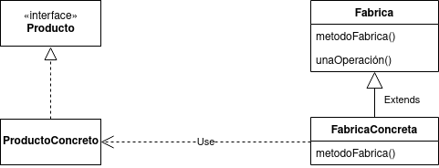

# Factory

El patron de diseño Factory (Fabrica) define una interface para crear un objeto, pero delega la resoponsabilidad de instanciarlos a cada una de las subclases. El metodo abstracto fabrica es el que permite delegar dicha responsabilidad las subclases.



Todos los productos deben implementar la misma interfaz, para asi cada clase que utiliza los productos pueda referenciar a la interfaz y no a una clase especifica.

## Ejemplo
Supongamos que queremos crear un juego en el que tenemos 2 clases de enemigos: los enemigos normales, que aparecen durante todo el juego, y los jefes, que solo aparecen en momentos concretos del juego. Ambos tipos enemigos a medida que avanza el juego, empiezan a aparecer con una mayor cantidad de vida.
Para implementarlo con el patron de diseño Factory, lo hariamos de la siguiente manera:


La implementacion en java quedaria asi:

##### Clase abstracta factory:
```java
public abstract class Spawn{
    public Spawn(){...} //Constructor
    public abstract Enemigo spawnEnemy(); //metodo abstracto fabrica
    public void aumentarVida(){...} //operacion que aplica a cualquier fabrica
}
```

##### Subclases factory
```java
public class SpawnNormal{
    private int spawnVida;
    public SpawnNormal(){
        this.spawnVida = 5;
    }
    public Enemigo spawnEnemy(){
        return new EnemigoNormal()
    }
    public void aumentarVida(){
        this.vida += 2;
    }
}
```
```java
    public class SpawnJefe{
        private int spawnVida;
        public SpawnNormal(){
            this.spawnVida = 11;
        }
        public Enemigo spawnEnemy(){
            return new Jefe()
        }
        public void aumentarVida(){
            this.vida += 3;
        }
    }
```

##### Interfaz Producto
```java
    public interface Enemigo(){
        ...
    }
```

##### Cases que implementan un producto concreto
```java
    public class EnemigoNormal implements Enemigo{
        private int vida;
        public EnemigoNormal(int vida){
            this.vida = vida
        }
    }
```
```java
    public class Jefe implements Enemigo{
        private int vida;
        public Jefe(int vida){
            this.vida = vida
        }
    }
```
