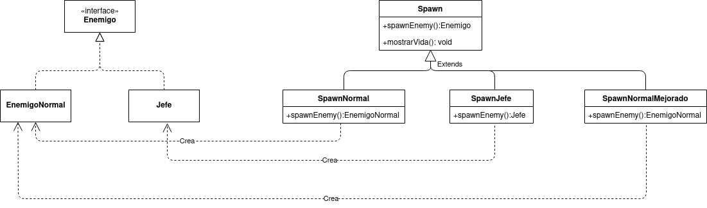

# Factory

El patrón de diseño Factory (Fabrica) define una interfaz para crear un objeto, pero delega la responsabilidad de instanciarse a cada una de las subclases. El método abstracto fábrica es el que permite delegar dicha responsabilidad las subclases.


Todos los productos deben implementar la misma interfaz, para así cada clase que utiliza los productos pueda referenciar a la interfaz y no a una clase específica.

## Ejemplo
Supongamos que queremos crear un juego en el que tenemos 2 clases de enemigos: los enemigos normales, que aparecen durante todo el juego, y los jefes, que solo aparecen en momentos concretos del juego. Ambos tipos enemigos a medida que avanza el juego, empiezan a aparecer con una mayor cantidad de vida.
Para implementarlo con el patrón de diseño Factory, lo haríamos de la siguiente manera:


La implementación en java quedaria asi:

##### Clase abstracta factory:
```java
public abstract class Spawn{
    public Spawn(){...} //Constructor
    public abstract Enemigo spawnEnemy(); //metodo abstracto fabrica
    public void aumentarVida(){...} //operacion que aplica a cualquier fabrica
}
```

##### Subclases factory
```java
    public class SpawnNormal{
        private int spawnVida;
        public SpawnNormal(){
            this.spawnVida = 5;
        }
        public Enemigo spawnEnemy(){
            return new EnemigoNormal()
        }
        public void aumentarVida(){
            this.vida += 2;
        }
    }
```
```java
    public class SpawnJefe{
        private int spawnVida;
        public SpawnNormal(){
            this.spawnVida = 11;
        }
        public Enemigo spawnEnemy(){
            return new Jefe()
        }
        public void aumentarVida(){
            this.vida += 3;
        }
    }
```

##### Interfaz Producto
```java
    public interface Enemigo(){
        ...
    }
```

##### Clases de un producto concreto
```java
    public class EnemigoNormal implements Enemigo{
        private int vida;
        public EnemigoNormal(int vida){
            this.vida = vida
        }
    }
```
```java
    public class Jefe implements Enemigo{
        private int vida;
        public Jefe(int vida){
            this.vida = vida
        }
    }
```

Qué sucede si ahora queremos que se creen enemigos normales, pero con mayor cantidad de vida pero que esto ocurra cada x tiempo para crear enemigos que sean un poco más difíciles que los normales?
Para esto podríamos simplemente aumentar la vida con la que aparecen con la función aumentarVida()... NO!!, esto haría que TODOS los enemigos aparecieran con esa nueva vida. La solución correcta sería agregar una nueva subclase factory que implemente el enemigo normal pero con mayor cantidad de vida.



```java
    public class SpawnNormalMejorado{
        private int spawnVida;
        public SpawnNormal(){
            this.spawnVida = 8;
        }
        public Enemigo spawnEnemy(){
            return new EnemigoNormal()
        }
        public void aumentarVida(){
            this.vida += 2;
        }
    }
```

En este patrón de diseño puedes crear tanta cantidad de fábricas con la cantidad y/o combinación de productos como quieras.
