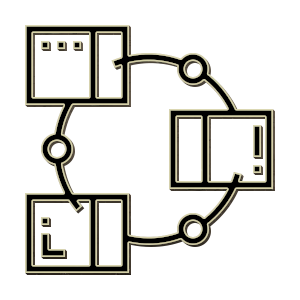

# Patrones de Diseño

  Patrones de diseño con ejemplos. Este repositorio surge a partir de un reto personal que tiene como fin aprender patrones de diseño.

### Patrones Creacionales
Estos patrones se utilizan cuando debemos crear objetos pero debemos tomar decisiones dinámicamente en el proceso de creación.

[Factory]:https://github.com/M0squ3ra/Design-Patterns/blob/master/Factory
- [Factory]

[Singleton]:https://github.com/M0squ3ra/Design-Patterns/tree/master/Singleton
- [Singleton]

### Patrones estructurales
Nos describen como utilizar estructuras de datos complejas a partir de elementos más simples.

[Adapter]:https://github.com/M0squ3ra/Design-Patterns/blob/master/Adapter
- [Adapter]

[Facade]:https://github.com/M0squ3ra/Design-Patterns/blob/master/Facade
- [Facade]

[Composite]:https://github.com/M0squ3ra/Design-Patterns/blob/master/Facade
- [Composite]

### Patrones comportamentales
El fin de este tipo de patrones es gestionar algoritmos, relaciones y responsabilidades entre objetos.

[Command]:https://github.com/M0squ3ra/Design-Patterns/blob/master/Command
- [Command]

[Strategy]:https://github.com/M0squ3ra/Design-Patterns/tree/master/Strategy
- [Strategy]
