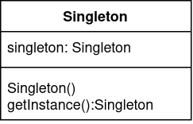
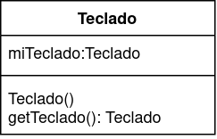

# Singleton
El patrón Singleton se asegura de que una clase determinada tenga una sola instancia, y provee un punto global para acceder a esta. Este patrón se logra declarando como privado el constructor de la clase y definiendo un método que crea una instancia del objeto si es que no existe.



## Ejemplo
Supongamos que tenemos un juego de un solo jugador, en el que este debe usar el teclado para mover al personaje. Para mapear el teclado con los movimientos del personaje, existe una clase llamada Teclado:
```java
    public class Teclado{
        public Teclado(){ //constructor
            mapearTeclado();
        } 
        private mapearTeclado(){...}
    }
```
Aca tenemos un claro problema, y es que nada impediría que se pueda hacer lo siguiente:
```java
    public class Juego(){
        Teclado t1 = new Teclado();
        Teclado t2 = new Teclado();
    }
```
Esto ocasiona que existan dos teclados para el mismo juego, situación ilógica ya que el juego es para un solo jugador. Para solucionar este problema se puede utilizar el patrón Singleton    


Quedando la clase Teclado de la siguiente manera:
```java
    public class Teclado{
        private Teclado miTeclado;
        private Teclado(){ //constructor privado
            mapearTeclado();
        } 
        private mapearTeclado(){...}
        
        public static Teclado getTeclado(){
            if(this.miTeclado == null){
                this.miTeclado = new Teclado();
            }
            return this.miTeclado
        }
    }
```
Para obtener una instancia de teclado solo se necesita llamar al método getTeclado:
```java
    public class Juego(){
        Teclado t1 = Teclado.getTeclado();
        Teclado t2 = Teclado.getTeclado(); 
        //t1 y t2 son la misma instancia (mismo puntero)
    }
```
De esta manera logramos que solo exista una instancia de Teclado.
