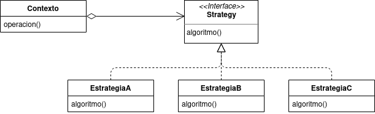
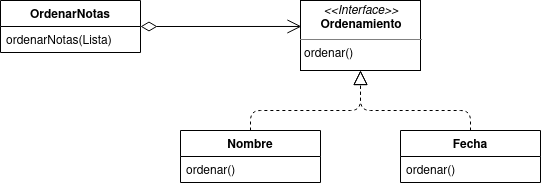

# Strategy
El patron Strategy define una familia de algoritmos, los encapsula y los hace intercambiables. Strategy permite que el algoritmo varie independientemente de quien lo use. El uso de este patron permite la seleccion de uno u otro algoritmo en tiempo de ejecucion



## Ejemplo
Supongamos que tenemos una aplicacion que permite a los usuarios crear notas para almacenarlas y luego ser leidas, seleccionandolas de una lista en la que aparecen todas ellas. Dichas notas, como pueden ser muchas, deben tener un cierto orden que facilite al usuario la navegacion por las mismas. La aplicacion permite que el usuario elija la menera en que las notas son ordenadas, pudiendo seleccionar entre dos metodos de ordenamiento: Por nombre o por fecha de creacion. Para resolver este problema utilizando el patron Strategy lo haremos de la siguiente manera:



##### Strategy
```java
   public interface Ordenamiento{
       public void ordenar(Lista);
   }
```
##### Estrategias
```java
    public class Nombre implements Ordenamiento{
        public void ordenar(Lista){...} //ordena la lista por nombre
    }
```
```java
    public class Fecha implements Ordenamiento{
        public void ordenar(Lista){...} //ordena la lista por fecha
    }
```
##### Contexto
```java
    public class OrdenarNotas{
        private Ordenamiento ord;
        public Notas(Ordenamiento ord){
            this.ord = ord;
        }
        public void ordenarNotas(Lista notas){
            return ord.ordenar(notas);
        }
    }
```
De esta manera ya tenemos las notas ordenadas sin la necesidad de tener dos clases diferentes para ordenar notas (una por cada tipo de ordenamiento), logrando asi que el codigo sea mucho mas limpio. Si en un futuro el creador de la app decidiera agregar otro metodo de ordenamiento, tan solo deberia crear otra estrategia que implemente la interfaz Ordenamiento.

